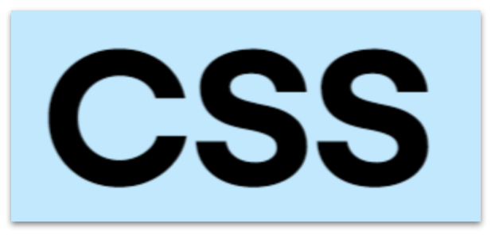

## (1) CSS란

> CSS는 `웹 문서의 시각적 스타일(레이아웃, 색상, 타이포그래피 등)`을 정의하는 언어입니다. 
> HTML이 구조(뼈대)를 제공하면, CSS는 그 위에 옷을 입혀 외형을 만듭니다.

## (2) 기본 문법

```css
/* 선택자 {속성: 값;} */
p { color: #333; font-size: 16px; }
```

> 적용 방법:

1. 인라인: `<p style="color:red">`
2. 내부(style 태그): `<style>...</style>`
3. 외부 파일: `<link rel="stylesheet" href="styles.css">`

## (3) 선택자(Selectors)

- **요소 선택자**: `p`, `h1`
- **클래스**: `.btn`
- **아이디**: `#header`
- **자식·후손**: `nav ul li` , `header > h1`
- **속성 선택자**: `input[type="text"]`
- **의사 클래스**: `a:hover`, `input:focus`
- **의사 요소**: `p::first-line`, `a::after`
- **그룹/혼합**: `.box, .card {}` , `button.primary:hover {}`

## (4) 박스 모델(Box Model)

> 요소 = `content` + `padding` + `border` + `margin`.

```css
.box {
  width: 200px;
  padding: 10px;
  border: 1px solid #ddd;
  margin: 20px;
  box-sizing: border-box; /* 추천: padding/border를 width에 포함 */
}
```

> `box-sizing: border-box`를 전역으로 쓰는 게 실무 권장

## (5) 레이아웃 핵심: display, position, float(과거)

- `display`: `block`, `inline`, `inline-block`, `none`, `flex`, `grid`
- `position`: `static`, `relative`, `absolute`, `fixed`, `sticky`
- `float`: 예전 레이아웃 용(요즘은 flex/grid 권장)

> 고정 헤더

```css
header { position: fixed; top: 0; left:0; right:0; }
```

## (6) Flexbox — 1차원 레이아웃(가로/세로 정렬 쉬움)

> 부모에 적용:

```css
.container { display: flex; justify-content: center; align-items: center; gap: 16px; }
.item { flex: 1; } /* 자동으로 공간 분배 */
```

- `justify-content`: 주축 정렬 (left/center/space-between 등)
- `align-items`: 교차축 정렬 (top/center/stretch 등)
- `flex-direction`: `row` / `column`

## (7) Grid — 2차원 레이아웃(복잡한 격자)

```css
.grid {
  display: grid;
  grid-template-columns: 1fr 2fr 1fr;
  grid-gap: 16px;
}
```

- 행·열을 자유롭게 정의 가능 (`grid-template-rows`, `grid-column`, `grid-row`)
- Grid는 복잡한 레이아웃(대시보드 등)에 최적

## (8) 단위(Unit) — 크기 표현

- 절대: `px`, `cm` (픽셀 고정)
- 상대: `em`(요소의 폰트 크기 기준), `rem`(루트 html 기준), `%`, `vw`/`vh`(뷰포트 비율)
- 권장: `rem`과 `%`를 조합하면 반응형에 유리

> 예: font-size: 1.125`rem`;

## (9) 색상 표현

- 16진수: `#RRGGBB` / `#RGB`
- rgb/rgba: `rgb(255,0,0)` / `rgba(255,0,0,0.5)`
- hsl: `hsl(200, 50%, 40%)`
- CSS 색상 함수: `color: color-mix(...)` (브라우저 지원 확인 필요)

## (10) 폰트와 타이포그래피

```css
body {
  font-family: "Noto Sans KR", system-ui, -apple-system, "Segoe UI", sans-serif;
  line-height: 1.6;
  letter-spacing: -0.01em;
}
```

- 웹폰트: Google Fonts, self-hosted
- 접근성: `line-height` 충분히, 글자 크기 가변 허용

## (11) 전환(Transitions)과 애니메이션(Animations)

> 간단한 전환:

```css
.button { transition: background-color 0.25s ease; }
.button:hover { background-color: #0053a6; }
```

> 키프레임 애니메이션:

```css
@keyframes fadeIn { from {opacity:0} to {opacity:1} }
.box { animation: fadeIn 0.6s ease both; }
```

## (12) 반응형(Responsive) — Media Query

```css
/* 모바일 우선 */
.container { padding: 16px; }

@media (min-width: 768px) {
  .container { padding: 32px; }
}
```

- 모바일 퍼스트(min-width) 권장
- breakpoints: 480/768/1024/1200 기준 많이 사용


## (13) CSS 변수(Custom Properties)

```css
:root {
  --main-color: #0d6efd;
  --gap: 16px;
}

.button { background: var(--main-color); margin: var(--gap); }
```

> 장점: 테마, 재사용성, 런타임 변경(자바스크립트로도 조정 가능)

## (14) 우선순위: Cascade & Specificity & !important

- 스타일 적용 우선순위: 브라우저 기본 < 외부 CSS < 내부 < 인라인
- Specificity 계산: id > class/attr/pseudo-class > element
- `!important`는 디버깅 용도로만 사용 — 남용 금지

> 예: `.nav a.active {}`가 `#nav a {}`보다 낮을 수 있음

## (15) 전처리기(Preprocessor) — Sass / Less

- 변수, 중첩, 믹스인, 함수 등 제공 → 유지보수성 ↑
- 예: `.scss` 파일 컴파일 필요
- 요즘은 CSS 변수 + 빌드 도구(포스트CSS)로 대체하는 경우도 많음

## (16) 모던 도구

- PostCSS, Autoprefixer (브라우저 호환성 자동 처리)
- CSS-in-JS: styled-components, emotion (React 환경)
- Tailwind CSS: 유틸리티 퍼스트(클래스 기반 스타일링) — 생산성 높음
- 빌드: Webpack, Vite 등

## (17) 접근성·성능·모범 사례

- 접근성: 색 대비(AA/AAA), 폰트 크기 가변성, focus 스타일 유지(`:focus`), 콘텐츠 숨김은 `aria` 고려
- 성능: CSS 파일 크기 줄이기(불필요 코드 제거), critical CSS(초기 렌더링용 CSS 인라인), CSS 파일 병합/압축
- 유지보수: BEM 또는 ITCSS 등 네이밍 규칙, 컴포넌트 단위 스타일

## (18) 디버깅 팁

- 브라우저 개발자 도구(F12) → Elements → Styles 패널로 우선순위 확인
- `outline: 2px solid red;` 등 임시 표시로 레이아웃 문제 파악
- `display`/`box-sizing`/`overflow` 확인

## (19) 요약 체크리스트

- 클래스 중심 사용, 인라인 스타일 최소화
- `box-sizing: border-box` 적용
- 모바일 퍼스트(미디어쿼리)
- Flexbox / Grid 마스터하기
- CSS 변수로 테마 관리
- 접근성(포커스, 대비, 대체 텍스트) 고려
- 빌드 도구(Autoprefixer) 사용 권장
