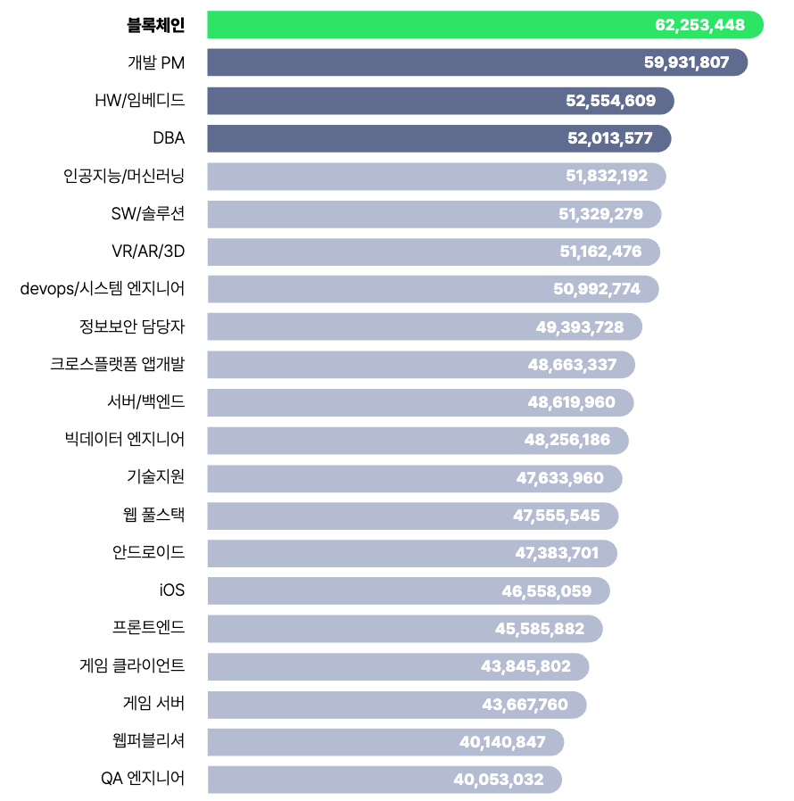
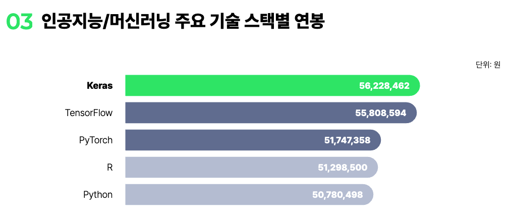
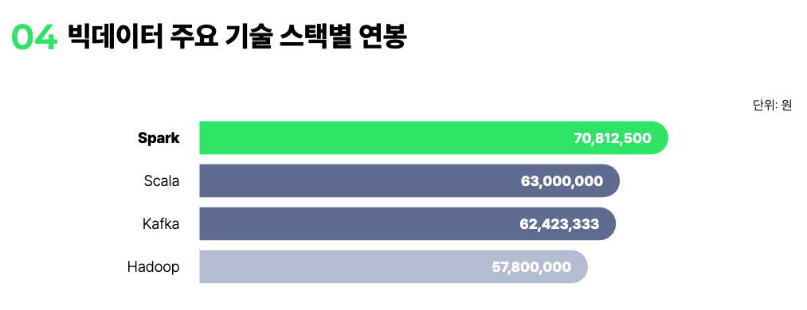
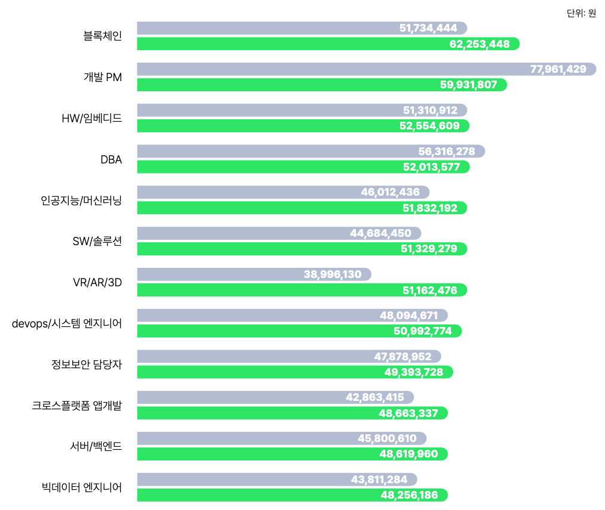

## 1. 소프트웨어 개발자의 핵심 역할

### ✔ 프로그램/서비스 설계

* 고객 또는 기획자의 요구사항을 분석해 **소프트웨어 구조, 기능, 흐름**을 설계합니다.
* 아키텍처(Architecture)나 시스템 구조를 정의하기도 합니다.

### ✔ 개발(코딩)

* Java, Python, JavaScript, C#, Go 등 언어를 사용해 프로그램을 실제로 구현합니다.

### ✔ 테스트 및 디버깅

* 기능이 제대로 동작하는지 테스트하고, 버그를 발견하여 수정합니다.

### ✔ 배포 및 운영

* 개발한 소프트웨어를 서버나 사용자 환경에 배포하고, 문제가 발생하면 대응합니다.

### ✔ 유지보수/업데이트

* 사용자 요구에 따라 기능을 추가하거나 성능을 개선합니다.

## 2. 필요한 기술들

### 📌 프로그래밍 언어

* **백엔드**: Java, Python, Node.js, Go, C#, PHP 등
* **프론트엔드**: JavaScript, TypeScript, React, Vue, HTML/CSS
* **모바일**: Kotlin, Swift, Flutter, React Native

### 📌 도구/기술 스택

* **버전 관리**: Git, GitHub, GitLab
* **데이터베이스**: MySQL, PostgreSQL, MongoDB
* **클라우드**: AWS, Azure, GCP
* **DevOps**: Docker, Kubernetes, CI/CD
* **테스트 툴**: Jest, JUnit, Cypress 등

### 📌 소프트 스킬

* 문제 해결 능력
* 논리적 사고
* 협업과 커뮤니케이션
* 새로운 기술을 배우는 능력

## 3. 소프트웨어 개발자의 직무 유형

### ✔ 프론트엔드 개발자

* 웹 화면(UI)을 개발하며 사용자 경험(UX)에 집중.
* React, Vue, Angular 등을 사용.

### ✔ 백엔드 개발자

* 서버, 데이터베이스, API 개발 담당.
* 비즈니스 로직과 시스템 안정성이 핵심.

### ✔ 풀스택 개발자

* 프론트엔드와 백엔드 모두 다룸.

### ✔ 모바일 앱 개발자

* iOS/Android 앱 개발.

### ✔ 인공지능/머신러닝 개발자

* 데이터 분석, 모델 개발, MLOps 등.

### ✔ 게임 개발자

* 게임 엔진(Unity, Unreal) 기반 개발.

### ✔ DevOps / SRE

* 시스템 안정성과 자동화, 배포 파이프라인 관리.

### ✔ 시스템/임베디드 개발자

* 하드웨어와 연동되는 저수준 소프트웨어 개발.

## 4. 커리어 성장 경로

### ✔ 주니어 개발자 (0~3년)

* 언어와 도구 익히기
* 코드 작성 및 버그 해결 중심

### ✔ 미들 개발자 (3~7년)

* 기능 설계와 프로젝트의 일부 책임
* 서비스 개선, 성능 최적화

### ✔ 시니어 개발자 (7년 이상)

* 아키텍처 설계
* 기술 리더십
* 프로젝트 주도

### ✔ 그 이후 경로

* 기술 리더(Tech Lead)
* 아키텍트(Architect)
* CTO(기술 총괄)
* 전문 기술 포지션으로 이동 (데이터, 보안 등)

## 5. 소프트웨어 개발자가 되기 위한 준비

* 프로그래밍 언어 하나(예: Python, JavaScript)부터 익히기
* 알고리즘/자료구조 공부
* Git 사용법 익히기
* 개인 프로젝트나 포트폴리오 제작
* 오픈소스 기여
* 취약한 부분(자료구조, 네트워크, OS 등 기본 CS 지식) 보완

## 6. 소프트웨어 개발자의 장점

* 높은 수요
* 원격 근무 가능
* 다양한 산업에서 활용
* 지속적인 성장 가능성

## [2025 개발자 연봉 리포트](https://jumpit.saramin.co.kr/report/2025/salary?utm_source=jumpit_per&utm_medium=main_home&utm_campaign=report_salary_2025&utm_term=report_salary_2025)

> 출처: `Jumpit`

### ✔ 직무별 평균 연봉

### ✔ 직무 대표 기술 스택별 연봉

- 가장 높은 연봉을 보인 C++은 `금융`, `보안`, `반도체`, `로보틱스` 등 고성능, 저지연 시스템이 필요한 산업군에서 여전히 핵심 언어로 사용되고 있습니다. 프로젝트 난이도와 코드 안정성 요구 수준이 높아, 숙련된 인력의 공급이 제한적인 점이 연봉 프리미엄으로 이어졌습니다.

- ***PHP의 높은 위치는 다소 의외로 보일 수 있지만***, 이는 `대형 커머스`·`공공기관 시스템`에서 ***레거시 유지보수*** 및 리뉴얼 수요가 꾸준히 발생하고 있기 때문입니다. 경험 많은 `시니어 인력` 중심의 채용이 많아 평균 연봉이 상대적으로 높게 형성된 것으로 보입니다.

- `Python`, `Node.js`, `Java`는 여전히 ***시장 주류로 자리 잡은 안정적 기술군***입니다. Python은 `데이터 분석`·`AI 백엔드`·`API 구축` 등 다양한 분야로 확장되며 범용성과 생산성을 중심으로 한 보상 안정화가 이루어졌고, Node.js와 Java는 각각 경량 웹 서비스와 기업용 시스템을 담당하는 대표적인 기술로 수요가 고르게 분포하고 있습니다.

- `Keras`는 ***TensorFlow***의 상위 레벨 API로, 빠른 프로토타이핑과 모델 구현 속도에 강점이 있습니다. 이는 특히 스타트업이나 빠르게 변화하는 환경에서 효율적인 모델 구현 능력을 가진 개발자에 대한 수요가 높다는 것을 시사합니다.

- `Python`과 `R`은 데이터 분석의 기본 언어로, ***AI/ML 분야뿐 아니라 광범위한 산업에서 사용됩니다.*** 상대적으로 개발자의 공급이 풍부하여 희소성이 낮습니다.

- `Pytorch`의 연봉이 `Keras/TensorFlow`보다 낮은 것은 시장이 ***‘연구 개발’보다는 ‘상업적 제품 구현 및 운영’에 더 많은 가중치를 두고 있음을 의미***합니다. 기업들은 ***당장의 상용화 가능한 기술(Keras/TensorFlow 기반)*** 에 더 많은 보상을 하고 있는 것으로 보입니다.

- `Spark`는 ***메모리 기반***으로 작동하여 기존의 디스크 기반 Hadoop 대비 수십 배 빠른 데이터 처리 속도와 실시간 스트리밍 처리 능력을 제공하기에 Spark를 사용하는 개발자는 고부가가치 시스템을 구축하는 핵심 인력으로 여겨집니다.

- `Hadoop`이 가장 낮은 연봉을 기록한 것은 시장이 빅데이터의 시작점에서’빅데이터의 활용 및 최적화로 이동했음을 시사합니다. Hadoop은 빅데이터 처리의 시대를 열었으나, 느린 속도와 복잡한 운영으로 인해 Spark, 클라우드 기반 웨어하우스 등으로 대체되는 추세이며 기술의 보편성이 높아지면서 상대적으로 다른 기술 대비 연봉이 낮게 형성된 것으로 보입니다.

### ✔ 2022 vs 2025 평균 연봉 비교

### ✔ 직무 수요와 연봉 비교

---

## [SW기술자 평균임금을 공표](https://www.sw.or.kr/site/sw/ex/board/View.do?cbIdx=304&bcIdx=61152&searchExt1=)

> 출처: `한국인공지능·소프트웨어산업협회` (KOSA)

| 구 분 |	월평균임금(M/M) |	일평균임금(M/D) | 시간평균임금(M/H) | 포함직무 |
| :---: | :---: | :---: | :---: | :---: |
| ① IT기획자 | 11,597,656 | 562,993 | 70,374 | |
| ② IT컨설턴트 | 9,706,020 | 471,166 | 58,896 | 정보보호컨설턴트 |
| ③ 업무분석가 | 8,997,359 | 436,765 | 54,596 | |
| ④ `데이터분석가` | 7,751,183 | 376,271 | 47,034 | | 
| ⑤ IT PM | 9,145,473 | 443,955 | 55,494 | |
| ⑥ `IT아키텍트` | 10,147,745 | 492,609 | 61,576 | `SW아키텍트`, `데이터아키텍트`, Infrastructure아키텍트, `데이터베이스아키텍트` |
| ⑦ `UI/UX기획/개발자` | 6,727,260 | 326,566 | 40,821 | UI/UX기획자, `UI/UX개발자` |
| ⑧ UI/UX디자이너 | 5,176,203 | 251,272 | 31,409 | |
| ⑨ `응용SW개발자` | 6,943,457 | 337,061 | 42,133 | `빅데이터개발자`, `인공지능개발자` |
| ⑩ 시스템SW개발자 | 6,099,042 | 296,070 | 37,009 | 임베디드SW개발자 |
| ⑪ `정보시스템운용자` | 10,154,626 | 492,943 | 61,618 | `데이터베이스운용자`, NW엔지니어, IT시스템운용자 |
| ⑫ IT지원기술자 | 5,058,021 | 245,535 | 30,692 | |
| ⑬ IT마케터 | 11,056,617 | 536,729 | 67,091 | SW제품기획자, IT서비스기획자, IT기술영업 |
| ⑭ IT품질관리자 | 9,692,094 | 470,490 | 58,811 | |
| ⑮ IT테스터 | 3,570,557 | 173,328 | 21,666 | |
| ⑯ IT감리 | 10,351,376 | 502,494 | 62,812 | |
| ⑰ 정보보안전문가 | 9,857,100 | 478,500 | 59,813 | 정보보호관리자, 침해사고대응전문가 |

> [시행일] 2025년 1월 1일부터 2025년 12월 31일까지 적용
