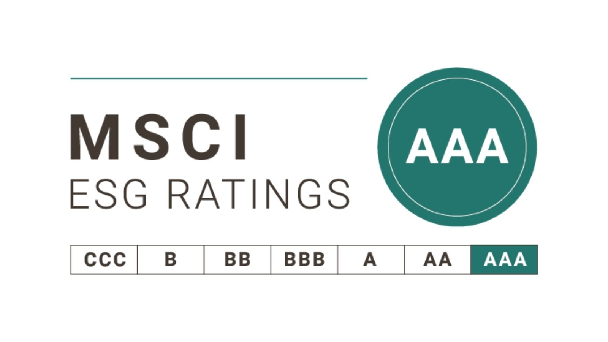

## (1) ESG란

`E(환경) / S(사회) / G(지배구조)` 세 가지 분야의 성과를 나타내는 데이터입니다.

| `요소` | `의미` | `대표 지표 예시` |
| :---: | :---: | :---: |
| **E (Environment)** | 환경 보호 및 기후 대응 | 탄소배출량, 재생에너지 비율, 폐기물·수자원 관리 |
| **S (Social)** | 사회적 책임·노동권·고객 영향 | 산업재해율, 직원 다양성, 인권·공급망 관리, 고객 개인정보 보호 |
| **G (Governance)** | 투명 경영·윤리 통제 | 이사회 구성, 부패 방지, 정보 공개 투명성 |

> → ESG는 “기업이 `얼마나 지속 가능하게` 운영되는가?”를 숫자로 보여준다.

## (2) ESG 데이터의 주요 출처

| `출처 유형` | `기관 예시` | `특징` |
| :---: | :---: | :---: |
| **기업 공시** | 지속가능경영보고서, 사업보고서 | 직접 공개, 규제 기반 |
| **ESG 평가기관** | MSCI, Sustainalytics, S&P Global, Moody’s ESG | 투자자 중심 평가 제공  |
| **국제 공시 플랫폼** | CDP, GRI, SASB, TCFD | 표준화된 데이터 제출 |
| **데이터/지표 전문 벤더** | Refinitiv, Bloomberg, FactSet | 정제된 지표 시계열 제공 |

> 최근 EU/한국에서 ESG 공시가 `법적 의무`로 확대

## (3) ESG 데이터 수집·평가 방식

> 1. **공시 기반 데이터 크롤링 및 정제**

- PDF, 웹, 데이터베이스에서 추출
- 텍스트 → 지표 변환(NLP·표준화)

> 2. **외부 데이터 수집**

- 환경 센서 데이터(탄소·에너지)
- 소셜 네트워크(여론), NGO 보고
- 법원/규제 기관 벌점

> 3. **스코어링 모델 적용**

- 지표 가중치 → 통합 ESG 점수
- 동종업계/지역 기반 비교

## (4) ESG 데이터 활용 사례

| `분야` | `활용 목적` |
| :---: | :---: |
| **투자(ESG 투자)** | 리스크 줄이고 장기 수익 확보 |
| **경영 전략** | 기후 대응, 인력 정책 개선 |
| **공급망 관리** | ESG 기준 미달 협력사 관리 |
| **위기 대응** | 부패·재해 등 평판 리스크 조기 감지 |

> 예: 금융기관은 `ESG 점수 낮은 기업 대출 금리↑`, 투자 비중↓ 경향

---

### (5) ESG 데이터 파이프라인

| `단계` | `기술` |
| :---: | :---: |
| 데이터 수집 | 크롤러(Python), API, ETL |
| 정합성 검증 | Kafka/Fluentd → Stream 처리(Spark) |
| 저장 | Snowflake, BigQuery, LakeHouse |
| 분석 모델 | ESG Risk Model, NLP 분석 |
| 시각화 | React Dashboard + BI(Tableau 등) |
| 인증/인가 | Spring Security + JWT + Gateway |

## (6) ESG 데이터가 어려운 이유

| `문제` | `원인` |
| :---: | :---: |
| **표준화 어려움** | 기관마다 평가 기준 상이 |
| **그린워싱 위험** | 기업의 선택적/과장 공시 |
| **정량화 한계** | 사회·윤리 요소 평가 모호 |
| **데이터 품질 낮음** | 검증되지 않은 제3자 데이터 |

> → `RT(Real-time) 데이터 기반 ESG`로 진화 중 (예: IoT 탄소 모니터링)
