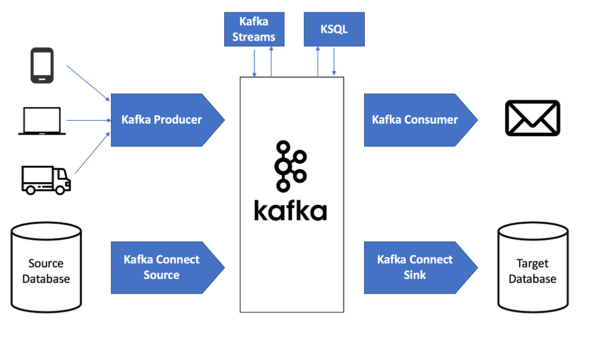

## (1) Apache Kafka란

> Kafka는 `실시간 데이터 스트림을 저장·처리·전달`하는 시스템으로 아래 특징을 가지고 있습니다

| `특징` | `설명` |
| :---: | :---: |
| 고성능(High Throughput) | 초당 수백만 건 이상의 이벤트 처리 가능 |
| 낮은 지연(Low Latency) | 실시간 데이터 전송 |
| 확장성(Scalability) | 수평 확장에 최적화 |
| 내구성(Durability) | 데이터를 디스크에 저장해 손실 방지 |
| 분산 아키텍처(Distributed) | 다수 서버 기반으로 안정성 확보 |

- `대용량 데이터를 실시간 스트리밍으로 처리`해야 하는 모든 시스템에 적합합니다.

## (2) 기본 구성 요소

| `구성 요소` | `역할` |
| :---: | :---: |
| Producer | 데이터를 Kafka에 보내는 애플리케이션 |
| Consumer | Kafka에서 데이터를 읽는 애플리케이션 |
| Broker | Kafka 서버 (데이터 저장 및 관리) |
| Topic | 데이터가 저장되는 카테고리 |
| Partition | 토픽의 물리적 분할(병렬 처리, 확장성 확보) |
| Consumer Group | 여러 소비자가 하나의 토픽을 분담해서 처리 |
| Zookeeper / KRaft | 클러스터 메타데이터 관리 (최근엔 KRaft로 대체 중) |

> 간단히 비유
- Topic은 `폴더`
- Partition은 `폴더 안 파일`
- Producer = 편지 보내는 사람
- Consumer = 편지 받는 사람

## (3) 데이터 처리 과정 (Flow)

- Producer → Topic의 Partition에 메시지 전송
- Broker가 메시지를 디스크에 저장 (Commit Log 형식)
- Consumer가 `자신의 Offset`을 기준으로 메시지 읽기
- 메시지는 기본적으로 삭제되지 않고 저장되어 다른 소비자가 이후에도 읽기 가능

> Kafka는 메시지 Queue처럼 읽으면 사라지는 구조가 아니라
`기록 저장소(Log Store) + 스트리밍 시스템`이 결합된 형태입니다.

## (4) 핵심 기능 정리

| `기능` | `설명` |
| :---: | :---: |
| 고가용성 | Replication을 통해 장애 발생 시에도 안전 |
| 확장성 | Broker, Partition을 늘려 부하 분산 |
| 메시지 보존 정책 | 시간/용량 기반 데이터 유지 설정 가능 |
| 역행 소비(Reprocessing) | Offset을 되돌려 데이터 재처리 가능 |
| Exactly Once Delivery | 중복 없이 정확하게 한 번 전달 지원 |

## (5) Kafka vs. 다른 메시징 시스템

| 비교 항목 | `Kafka` | `RabbitMQ/ActiveMQ` |
| :---: | :---: | :---: |
| 목적 | 실시간 스트리밍, 로그 저장 | 트랜잭션 메시징 |
| 데이터 보존 | 가능(파일 저장) | 기본적으로 읽으면 삭제 |
| 처리 방식 | Pull 기반 | Push 기반 |
| 처리 성능 | 매우 높음 | 상대적으로 낮음 |
| 확장성 | 뛰어남 | 중간 |

- Kafka는 `이벤트 스트리밍에 특화`
- RabbitMQ는 `실시간 메시지 라우팅에 특화`

## (6) 주요 사용 사례

| `사용 분야` | `예시` |
| :---: | :---: |
| 로그 및 이벤트 수집 | Web/App 로그, IoT 이벤트 |
| 실시간 분석 | Fraud detection, 실시간 지표 분석 |
| 데이터 파이프라인 | CDC(Change Data Capture), ETL 대체 |
| 마이크로서비스 통신 | 이벤트 기반 아키텍처(EA) |
| 데이터 연동 허브 | DB ↔ Cache ↔ Search(예: MySQL ↔ Redis ↔ Elasticsearch) |

- 특히 `MSA`(Microservice Architecture)와 함께 사용하면 시스템 간 결합도를 낮추는 데 효과적

## (7) 운영 시 고려사항

| `항목` | `고려 포인트` |
| :---: | :---: |
| Topic/Partition 설계 | 데이터 균형/병렬처리 |
| Replication Factor | 장애 대비 최소 3 |
| Broker 모니터링 | 메시지 적체 발생 방지 |
| Consumer Group 관리 | Rebalancing 안정화 |

## (8) Kafka와 Spring Boot 연동

- `Spring Kafka` 라이브러리 사용
- Producer, Consumer 자동 설정 가능
- Kafka Streams로 이벤트 처리 가능
- Kafka + Schema Registry(Avro/JSON) 조합
