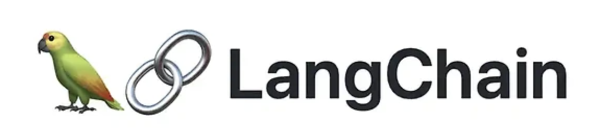

## (1) LangChain이란

- **LangChain**은 LLM(Large Language Model)을 중심으로 애플리케이션을 개발하기 위한 **Python/JavaScript 오픈소스 프레임워크**입니다.
- 핵심 목표는 **LLM을 다양한 외부 도구·데이터·API와 연결하여 복잡한 애플리케이션을 쉽게 구성**하게 만드는 것입니다.

### LangChain의 핵심 개념

> 1) **LLM Models**

- GPT, Claude, Gemini 등 다양한 모델을 통합적으로 사용할 수 있는 추상화 레이어 제공

> 2) **Prompt Templates**

- 프롬프트를 구조화하고 변수 바인딩을 편하게 만들어줌
- 예:
```
`"{question}에 간단히 답해주세요."`
```

> 3) **Chains**

- 여러 단계의 프롬프트·LLM 호출·도구 실행을 **파이프라인 형태로 연결**
- 예:
```
사용자 질문 → 검색 도구 실행 → 요약 → 최종 답변
```

> 4) **Agents**

- LLM에게 “어떤 도구를 언제 사용할지 선택하도록” 하는 구조
- 예: 계산이 필요하면 calculator tool을 자동 호출

> 5) **Memory**

- 대화 맥락을 저장하여 stateful한 상호작용 지원

> 6) **Tools / Retrievers**

- 웹검색, 계산기, 데이터베이스, 벡터스토어 등 다양한 외부 기능과 연결

> LangChain의 장점

- 생태계가 매우 크고 확장성 좋음
- 다양한 통합 지원 (OpenAI, Hugging Face, Pinecone, Weaviate, AWS, GCP 등)
- 간단한 LLM 앱부터 RAG, Agent 시스템까지 폭넓게 커버

> LangChain의 대표적인 활용 사례

- 챗봇 개발
- RAG 기반 검색 시스템 (Retrieval-Augmented Generation)
- 데이터 분석 assistant
- 워크플로우 Pipeline 구성
- 도구 기반 AI Agent

## (2) LangGraph란

- **LangGraph**는 LangChain 팀이 만든 **상태 기반(STATEFUL) 멀티스텝 LLM 애플리케이션 프레임워크**입니다.
- LLM 기반 워크플로우를 **그래프(노드/엣지)** 형태로 정의하여 **복잡한 로직·반복·분기·메모리 관리**를 안정적으로 구성할 수 있도록 설계되었습니다.

### LangGraph의 핵심 개념

> 1) **State (상태)**

- 각 노드는 상태를 입력받아 새 상태를 출력
- RAG 파이프라인, multi-agent 시스템에서 매우 중요

> 2) **Graph Nodes**

- 하나의 노드 = 하나의 작업(Task, LLM 호출, 도구 호출 등)
- 예:
	- Retriever 노드
	- LLM 답변 노드
	- Validation 노드
	- Rewriting 노드

> 3) **Edges (Transitions)**

- 조건부 이동 가능
  
- 예:
  - "정확도가 낮으면 다시 검색"
  - "요약이 너무 길면 다시 요약 요청"

> 4) **Loops**

- 그래프 내부 반복을 자연스럽게 지원
- 에이전트가 tool을 반복해서 사용할 때 매우 유용
- LangChain Agents는 무한 루프 위험이 있었음 → LangGraph는 이를 안전하게 통제

> 5) **Checkpoints / Persistence**

- 전체 그래프 실행 도중의 상태를 저장 가능
- 실패 후 재시도, 중단 후 재개 등을 지원

> 6) **Multi-Agent 시스템 구성에 최적화**

- “사람 역할 agent”, “도구 agent”, “문서 agent” 등 여러 AI agent를 유기적으로 연결 가능

### LangGraph의 장점

- **안정성**: 안전한 반복 구조, 무한 루프 방지
- **복잡한 워크플로우에 최적화**
- **상태(State) 관리가 매우 강력**
- **RAG, Multi-agent 시스템에 사실상 표준으로 자리잡는 중**

### LangGraph가 특히 잘하는 것

- Multi-turn Agent orchestration
- Multi-agent 협업 (예: Planner → Researcher → Writer)
- 강력한 RAG 보정 파이프라인
- 대규모 프로덕션 워크플로우
- 자동 재시도 및 에러 처리

## (3) LangChain vs LangGraph 차이 보기

| 기능 | `LangChain` | `LangGraph` |
| :---: | :---: | :---: |
| 목적 | LLM 앱을 쉽게 구축하는 범용 프레임워크 | 복잡한 상태 기반 LLM 시스템을 그래프 형태로 안정적 구축 |
| 구조 | 체인(Chains), 에이전트(Agents) 중심 | 명시적 상태(State) + 그래프(노드/엣지) |
| 반복/루프 | 제한적, 에이전트 무한 루프 위험 | 안전하고 명시적인 반복 구성 가능 |
| 상태 관리 | 메모리 위주, 제한적 | 그래프 전체에 걸친 구조적 상태 관리 |
| 적합한 상황 | 간단한 애플리케이션 | 프로덕션급, 복잡한 RAG/에이전트 시스템 |
| 난이도 | 쉬움 | 중간–높음 |

> 참고 사항

- **간단한 LLM 앱을 빠르게 만들고 싶다** → LangChain
- **대화형 RAG 시스템을 운영하고 싶다** → LangGraph
- **여러 에이전트 협업 시스템을 만들고 싶다** → LangGraph
- **프롬프트/LLM/도구 조합을 실험하고 싶다** → LangChain
- **재시도·에러관리·체크포인트가 필요한 안정적인 프로덕션 서비스** → LangGraph
