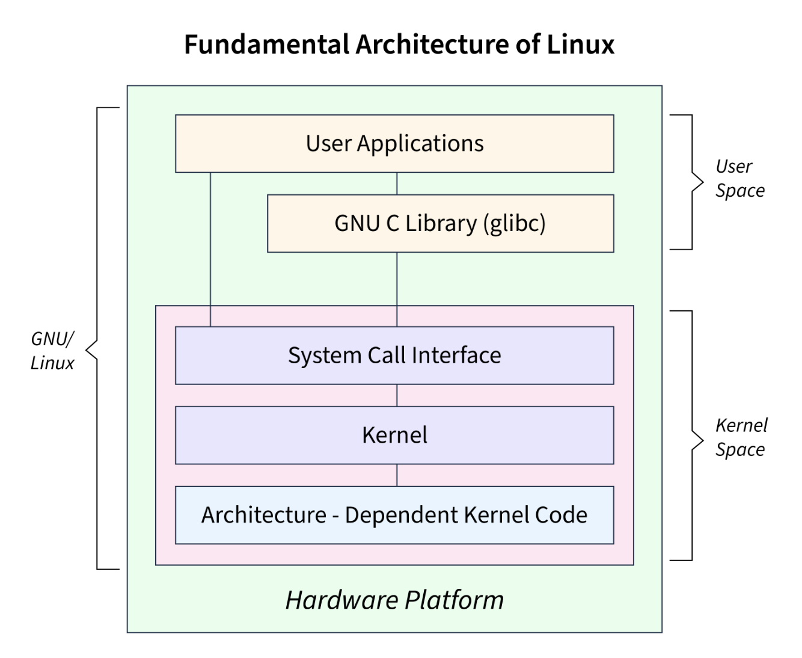
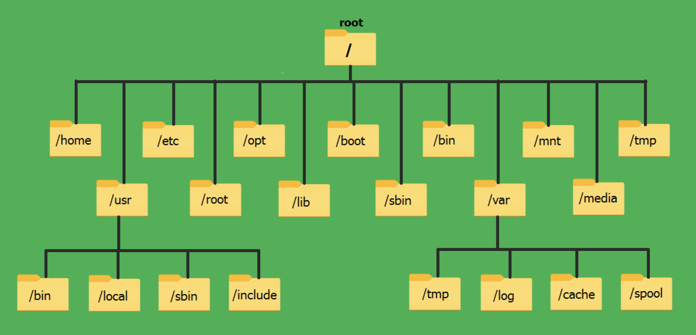

## (1) Linux란

> 리누스 토발즈(Linus Torvalds)가 1991년에 처음 개발 하였습니다.
> Linux는 `리눅스 커널(Linux Kernel)`을 기반으로 만들어진 OS를 말합니다.

- `커널(Kernel):` 하드웨어와 소프트웨어를 연결해 주는 운영체제의 핵심 엔진
- GNU 프로젝트 도구들과 결합 → 우리가 쓰는 OS 형태 → `GNU/Linux`



## (2) 구조

| `레벨` | `구성 요소` | `설명` |
| :---: | :---: | :---: |
| 사용자 영역(User Space) | Shell, GUI, Applications | 사용자가 직접 이용하는 부분 |
| 시스템 라이브러리 | glibc 등 | API 제공, 커널 호출을 지원 |
| 커널(Kernel) | 프로세스, 메모리, 파일 시스템, 네트워크 | 하드웨어 자원 관리 |
| 하드웨어 | CPU, RAM, Disk 등 | 커널이 직접 제어 |

> 커널의 핵심 역할

- 프로세스 관리
- 메모리 관리
- 파일 시스템 관리
- 네트워크 및 장치 드라이버 제어



## (30) Linux의 대표 배포판(Distro)

| `계열` | `대표 배포판` | `특징` |
| :---: | :---: | :---: |
| Debian 계열 | `Ubuntu`, Linux Mint | 사용자 친화적, 데스크탑 인기 |
| RedHat 계열 | `RHEL`, CentOS, Fedora | 서버 시장에 강함, 기업 지원 |
| Arch 계열 | Arch Linux, Manjaro | 커스터마이징 자유도 최고 |
| 특수 목적 | Kali Linux, Android | 보안/모바일 등 특화 기능 |

## (4) Linux vs Windows vs macOS

| 항목     | `Linux` | `Windows` | `macOS` |
| :---: | :---: | :---: | :---: |
| 라이선스 | 무료, 오픈소스 | 유료 | Apple 기기 상에서만 |
| 안정성 | 매우 높음 | 중간 | 높음 |
| 서버 활용 | 업계 표준 | 낮음 | 제한적 |
| 커스터마이징 | 매우 자유도 높음 | 제한적 | 제한적 |
| 게임 | 과거 약함 → 최근 ↑ | 매우 강함 | 중간 |

> 클라우드 서버의 90% 이상이 Linux 기반
- AWS Amazon Linux, Google COS 등

## (5) Linux의 장점 & 단점

> 장점

- 무료 & 오픈소스 → 비용 절약
- 높은 안정성, 성능, 보안
- 서버/개발/네트워크 환경에 최적
- 다양한 하드웨어에서 실행 가능
- 자동화 & 터미널 활용 강력

> 단점

- 일반 사용자에게 사용 난이도 있음
- 애플리케이션 호환성 문제 존재
- GUI 환경 통일성이 부족할 수 있음

## (6) 주요 기술 요소

| `요소` | `예시` |
| :---: | :---: |
| 셸(Shell) | Bash, Zsh |
| 패키지 관리 | apt, yum, dnf, pacman |
| 데스크탑 환경 | GNOME, KDE, XFCE |
| 파일 시스템 | ext4, XFS, Btrfs |

> Linux는 `계층적 디렉토리 구조`(/bin, /etc, /home 등)도 중요한 개념

## (7) 어디에 활용될까?

| `분야` | `사례` |
| :---: | :---: |
| 서버/클라우드 | AWS, Naver Cloud, Apache, Nginx |
| 임베디드 | 스마트TV, 자동차 IVI |
| 스마트폰 | Android는 Linux 기반 |
| 슈퍼컴퓨터 | TOP500 중 대부분 Linux |
| 개발 환경 | Docker, Kubernetes 모두 Linux 친화 |

---

## Linux CLI(명령줄) 요약

- **터미널(shell)**: 사용자와 OS 커널 사이 인터페이스 (대표: Bash, Zsh, sh)
- **표준 입출력**: stdin (fd 0), stdout (fd 1), stderr (fd 2)
- **파이프 `|`**: 한 명령의 stdout을 다음 명령의 stdin으로 전달
- **리다이렉션**: `>` `>>` `<` 등으로 파일 입출력 제어
- **프로세스/작업 제어**: 백그라운드(`&`), 포그라운드, `jobs`, `fg`, `bg`, `kill`
- **권한/유저**: `chmod`, `chown`, `sudo`

> 자주 쓰는 기본 명령어

- `ls` — 디렉토리 목록
  `ls -la /etc` : 숨김파일 포함, 자세히 출력 (`-l`,`-a`)
- `cd` — 디렉토리 이동
  `cd -` : 이전 디렉토리로
- `pwd` — 현재 경로 출력
- `cp` — 파일 복사
  `cp -r src/ dest/` : 디렉토리 재귀 복사
- `mv` — 이동(이름 변경)
- `rm` — 삭제
  `rm -rf dir/` : **주의**, 재귀 강제 삭제
- `mkdir` — 디렉토리 생성 `mkdir -p a/b/c`
- `touch` — 빈 파일 생성/타임스탬프 갱신
- `cat`, `tac` — 파일 내용 출력(역순은 `tac`)
- `less`, `more` — 페이징
- `head`, `tail` — 앞/뒤 N줄(`tail -f` 실시간 로그)
- `grep` — 패턴 검색
  `grep -n 'pattern' file` (`-i` 대소문자 무시, `-r` 재귀)
- `find` — 파일/디렉터리 탐색
  `find /var -type f -name '*.log' -mtime -7` (7일 이내 수정)
- `wc` — 단어/라인/바이트 수 (`wc -l` 줄 수)
- `cut`, `awk`, `sed` — 텍스트 처리 (아래 고급에서 자세히)
- `sort`, `uniq` — 정렬/중복 제거 (`sort -k 2 -n`, `uniq -c`)
- `tar`, `gzip`, `gunzip` — 압축 및 묶음
  `tar czf archive.tar.gz dir/` / `tar xzf archive.tar.gz`
- `chmod`, `chown` — 권한/소유자 변경 (`chmod 755 script.sh`)
- `ln -s target link` — 심볼릭 링크
- 프로세스 관련: `ps aux | grep myapp`, `top`(혹은 `htop`)
- `systemctl` / `service` — 서비스 관리 (systemd 사용 시)
  `sudo systemctl restart nginx`
- 네트워크: `ssh user@host`, `scp`, `rsync -avz`, `curl`, `wget`, `netstat`/`ss`
- 패키지 매니저: Debian 계열 `apt`, RHEL 계열 `yum`/`dnf`, Arch `pacman`
- 로그/저널: `journalctl -u service` (systemd)

> 표준 입출력, 리다이렉션, 파이프

- 표준 오류 분리: `cmd 2> error.log`
- stdout append: `cmd >> out.log`
- stderr도 stdout으로 합치기: `cmd > out.log 2>&1`
- 파이프 예: `ps aux | grep nginx | awk '{print $2}'` (nginx 프로세스 ID 추출)
- here-doc (여러 줄 입력):

```bash
cat <<EOF > file.txt
line1
line2
EOF
```

> 텍스트 처리 도구

- `grep` + `wc`: `grep -i 'error' app.log | wc -l` (error 건수)
- `awk`: 필드 기반 처리

```bash
# 3번째 컬럼만 출력
awk '{print $3}' file.txt
# CSV에서 2번째 컬럼, 합계
awk -F, '{sum+=$2} END{print sum}' data.csv
```
- `sed`: 스트림 편집(치환 등)

```bash
sed 's/old/new/g' file > file.new
# 파일에서 3번째 줄 삭제
sed '3d' file
```
- `cut`: 고정 필드 분리
  `cut -d: -f1 /etc/passwd` (콜론으로 분리하여 첫 필드)

## Shell Script 기초 — 구조와 문법

> 시작(쉐뱅)

```bash
#!/usr/bin/env bash
# 또는: #!/bin/bash
```

> 실행 권한

```bash
chmod +x script.sh
./script.sh
```

> 변수

```bash
NAME="Alice"
echo "Hello $NAME"
# 읽기 전용(상수)
readonly FOO="bar"
```

> 명령 결과를 변수에 저장

```bash
DATE=$(date +%F)
FILES=$(ls -1 | wc -l)
```

> 배열 (Bash)

```bash
arr=(one two three)
echo "${arr[0]}"
for i in "${arr[@]}"; do echo "$i"; done
```

> 조건문

```bash
if [ -f "$file" ]; then
  echo "file exists"
elif [ -d "$file" ]; then
  echo "dir"
else
  echo "not exists"
fi
```

- 주의: `[` 는 `test` 명령. 공백 중요. `[[`는 bash 확장 (패턴매칭 등)

> 문자열 비교 / 수치 비교

- 문자열: `=` , `!=`
- 수치: `-eq -ne -lt -le -gt -ge`
- `[[ $a == z* ]]` : 패턴 매칭

> 반복문

```bash
for f in *.txt; do
  echo "$f"
done

while read -r line; do
  echo "line: $line"
done < file.txt
```

> 함수

```bash
greet() {
  echo "Hi $1"
}
greet "Bob"
```

> 종료 코드

* `exit 0` 성공, `exit 1` 실패
* `$?` : 직전 명령의 종료 코드

## 고급 텍스트 처리: `awk` & `sed` 실용 예

- CSV에서 특정 컬럼 합산:
  `awk -F, 'NR>1{sum+=$3} END{print sum}' file.csv`
- 로그에서 IP만 뽑아 상위 10개:
  `awk '{print $1}' access.log | sort | uniq -c | sort -nr | head`
- `sed`로 파일 내부 치환(원본 백업):
  `sed -i.bak 's/old/new/g' file.txt`  (macOS는 `-i ''` 필요)

## 디버깅 & 린팅 도구

- `bash -n script.sh` : 문법 검사
- `bash -x script.sh` 또는 `set -x` : 실행 시 각 명령 출력(트레이스)
- `shellcheck` : 정적 분석(권장, 설치해서 사용)

## 자주 발생하는 실수 & 주의사항

- 변수 사용할 때 **쌍따옴표**로 감싸기: `"$var"` (공백/특수문자 안전)
- `rm -rf`는 항상 조심. 테스트용으로는 `rm -rf -- "$dir"` (이중 대시)
- `eval` 사용은 최대한 피하기 (보안 이슈)
- `sudo`의 범위: 한 커맨드에만 적용됨. 스크립트 전체 권한 상승은 주의
