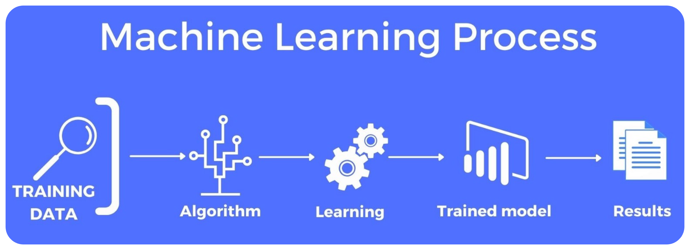

## (1) 머신러닝이란

> 머신러닝(Machine Learning)은 컴퓨터가 `명시적인 프로그래밍 없이 데이터로부터 패턴을 학습`하여 `예측이나 의사결정`을 수행하도록 하는 인공지능(AI)의 한 분야입니다.

> 사람이 직접 "규칙"을 짜는 대신, 컴퓨터가 `데이터에서 규칙을 스스로 찾아내는 것`이 핵심입니다.

## (2) 머신러닝의 기본 유형

| `구분` | `설명` | `예시` |
| :---: | :---: | :---: |
| **지도학습 (Supervised Learning)** | 입력과 정답(라벨)이 모두 있는 데이터로 학습 | 스팸메일 분류, 주가 예측 |
| **비지도학습 (Unsupervised Learning)** | 정답(라벨)이 없는 데이터에서 구조를 학습 | 고객 군집화, 차원 축소 |
| **준지도학습 (Semi-supervised Learning)** | 일부 데이터만 라벨이 있고 나머지는 없음 | 라벨링 비용 절감형 모델 |
| **강화학습 (Reinforcement Learning)** | 보상을 통해 행동을 학습 | 자율주행, 게임 AI |

## (3) 주요 머신러닝 알고리즘

> **선형회귀 (Linear Regression)**

- **용도:** 연속형 값을 예측 (예: 집값, 매출)
- **아이디어:** 입력 변수와 출력 변수 사이의 선형 관계를 찾음
  [
  y = w_1x_1 + w_2x_2 + ... + b
  ]
- **특징:** 단순하고 해석이 쉬움

> **로지스틱 회귀 (Logistic Regression)**

- **용도:** 이진 분류 (예: 스팸 vs 정상)
- **아이디어:** 선형 결합을 **시그모이드 함수**를 통해 확률로 변환
  [
  P(y=1|x) = \frac{1}{1+e^{-(w·x+b)}}
  ]
- **특징:** 선형 결정 경계 / 출력이 확률값

> **K-최근접 이웃 (K-Nearest Neighbors, KNN)**

- **용도:** 분류 / 회귀
- **아이디어:** 새로운 데이터와 가장 가까운 **K개의 데이터의 다수결 혹은 평균**으로 예측
- **특징:** 단순하지만 계산량이 많음 (특히 데이터가 많을 때)

> **결정트리 (Decision Tree)**

- **용도:** 분류 / 회귀
- **아이디어:** 데이터의 특징값을 기준으로 가지를 나누어 트리 형태로 분류
- **특징:** 직관적 / 과적합(overfitting)에 취약

> **랜덤 포레스트 (Random Forest)**

- **용도:** 분류 / 회귀
- **아이디어:** 여러 결정트리를 무작위로 학습시켜 **앙상블(ensemble)**로 평균 또는 투표
- **특징:** 정확도 높고 과적합 완화

> **서포트 벡터 머신 (SVM, Support Vector Machine)**

- **용도:** 분류
- **아이디어:** 클래스 사이의 **마진(margin)**을 최대화하는 최적의 초평면을 찾음
- **특징:** 고차원 데이터에 강함 / 커널(kernel)로 비선형 문제 해결 가능

> **나이브 베이즈 (Naive Bayes)**

- **용도:** 분류
- **아이디어:** 베이즈 정리를 이용하여 확률적으로 예측
  [
  P(y|X) = \frac{P(X|y)P(y)}{P(X)}
  ]
- **특징:** 계산이 빠르고 텍스트 분류에 강함 (예: 스팸 필터링)

> **K-평균 군집화 (K-Means Clustering)**

- **용도:** 비지도학습 / 군집화
- **아이디어:** 데이터를 K개의 중심점(centroid) 기준으로 묶음
- **특징:** 간단하고 빠르지만 K를 미리 정해야 함

> **주성분 분석 (PCA, Principal Component Analysis)**

- **용도:** 차원 축소
- **아이디어:** 데이터의 분산이 가장 큰 방향(주성분)을 찾아 축소
- **특징:** 시각화나 노이즈 제거에 유용

> **신경망 (Neural Network)**

- **용도:** 복잡한 패턴 인식 (이미지, 음성, 텍스트 등)
- **아이디어:** 인간 뇌의 뉴런 구조를 모방하여 여러 층의 연산을 수행
- **대표 확장:**

  - CNN (Convolutional Neural Network): 이미지 처리
  - RNN (Recurrent Neural Network): 시계열 데이터
  - Transformer: 자연어 처리 (GPT, BERT 등)

## (4) 알고리즘 선택 가이드

| `목표` | `추천 알고리즘` |
| :---: | :---: |
| 연속형 값 예측 | 선형회귀, 랜덤포레스트 회귀, 신경망 |
| 범주형 분류 | 로지스틱회귀, SVM, 랜덤포레스트, 나이브베이즈 |
| 군집화 | K-means, DBSCAN, 계층적 군집화 |
| 차원 축소 | PCA, t-SNE, UMAP |
| 시계열 예측 | ARIMA, LSTM, Transformer |
| 이상치 탐지 | Isolation Forest, One-Class SVM |

## (5) 실제 활용 사례

| `분야` | `예시` |
| :---: | :---: |
| 금융 | 신용평가, 사기 탐지 |
| 헬스케어 | 질병 예측, 영상 진단 |
| 마케팅 | 고객 세분화, 추천 시스템 |
| 제조 | 설비 고장 예측, 품질 관리 |
| 자율주행 | 객체 인식, 경로 계획 |
