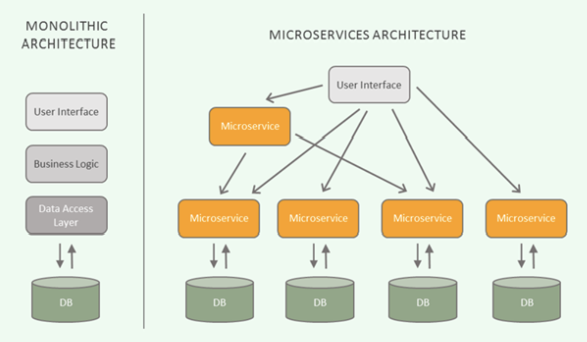

</img>

## Microsoft Architecture 란

마이크로서비스 아키텍처는 단일 애플리케이션(monolith)을 기능 단위로 `작고 독립적인 서비스들`로 분해해 개발·배포·운영하는 접근입니다. 각 서비스는 자체적으로 배포 가능하고(autonomous), 하나의 비즈니스 책임(예: 주문, 결제, 재고)을 담당합니다. 서비스 간 통합은 네트워크 호출(REST/gRPC/메시지)로 이뤄집니다.

</img>

### 장점

- `팀 생산성 & 독립 배포`: 서비스 단위로 팀을 분리해 병렬 개발/배포 가능
- `유연한 기술 선택`: 서비스마다 적합한 언어/DB 선택 가능
- `확장성`: 병목 서비스만 수평 확장 가능 → 비용 효율적
- `격리성`: 한 서비스 오류가 전체로 전파되는 위험 감소(잘 설계하면)
- `더 빠른 배포 사이클`: 작은 변경만 배포 → 배포 리스크 감소

### 단점 / 트레이드오프

- `복잡성`: 분산 시스템으로 전환되며 운영·추적·디버깅이 어려움
- `운영 비용 증가`: 인프라(네트워크, 모니터링, 오케스트레이션) 필요
- `데이터 일관성 문제`: 트랜잭션 관리가 어려워지고 eventual consistency가 요구됨
- `네트워크 지연 & 안정성 문제`: 호출 실패/지연에 대한 대비 필요

### 설계 원칙

- `Bounded Context 기반 분할`: 도메인 주도 설계(DDD)로 서비스 경계 정의
- `작고 자율적인 서비스`: 하나의 책임(단일 책임 원칙, SRP)
- `API 우선 설계`: 명확한 인터페이스(계약) → 버전 관리
- `데이터 캡슐화`: 서비스마다 DB 소유(공유 DB 지양)
- `통신 최소화`: 서비스간 통신은 최소화하고 비동기 가능하면 사용
- `탄력성(Resilience)`: 장애 대비(타임아웃, 재시도, 서킷 브레이커)
- `자동화`: 빌드/테스트/배포 자동화(CI/CD), 인프라 코드(IaC)

### 통신 패턴

> `동기 통신`
  - HTTP/REST (JSON) — 단순하고 널리 사용
  - gRPC — 고성능, 타입 안전(프로토콜 버퍼)

> `비동기 통신`
  - 메시지 브로커 (Kafka, RabbitMQ, Pulsar) — 이벤트 기반 아키텍처, 느슨한 결합

> 선택 가이드: 사용자 요청-응답 경로(저지연)는 동기, 비즈니스 이벤트·비동기 처리는 메시징 권장

### 데이터 관리 & 일관성

- `Database per Service`: 각 서비스가 자신의 DB 스키마 소유
- `분산 트랜잭션 회피`: 2PC는 복잡하므로 보통 사용하지 않음
- `Saga 패턴`: 장기/분산 트랜잭션을 로컬 트랜잭션과 보상(Compensation)으로 처리
- `Event Sourcing + CQRS`: 이벤트로 상태 변경을 저장하고 조회와 쓰기를 분리하여 확장성/일관성 관리
- `최종적 일관성(Eventual Consistency)`: 사용자에게도 인식되는 시점 고려

### 장애 대응·탄력성 패턴

- `서킷 브레이커` (예: Resilience4j/Hystrix) — 실패 확산 방지
- `타임아웃 & 재시도` — 지연과 잠김 방지 (exponential backoff)
- `Bulkhead` — 리소스 분리로 격리
- `Rate Limiting & Throttling` — 과부하 제어
- `Fallback` — 기본 응답 제공

### 서비스 발견 · 라우팅 · 보안

- `API Gateway`: 외부 트래픽 단일 진입점(경로, 인증, 라우팅, 레이트 제한, TLS 종료, 응답 캐시). (예: Spring Cloud Gateway, Kong, Ambassador)
- `Service Registry`: 동적 라우팅/서비스 등록 (예: Eureka, Consul) — Kubernetes 환경에선 K8s DNS/Service가 대신
- `mTLS / 인증·인가`: 서비스 간 신뢰(예: Istio, Linkerd로 mTLS), JWT/OAuth2로 사용자 인증
- `권한 부여`: 중앙 인증서버(Authorization Server)와 각 서비스의 Resource Server 분리

### 관찰성(Observability)

- `로깅`: 구조화 로그(JSON) → 중앙집중 로그(ELK/EFK, Loki)
- `모니터링`: 메트릭 수집(Prometheus) + 시각화(Grafana)
- `분산 트레이싱`: 요청의 서비스 경로 추적(Jaeger, Zipkin, OpenTelemetry)
- `알람`: SLO/SLA 기반 경보(예: latency, error rate)

### 배포 & 운영

- `컨테이너화`: Docker 이미지화 — 일관된 런타임
- `오케스트레이션`: Kubernetes — 서비스 디스커버리, 스케줄링, Auto-scaling
- `CI/CD`: GitOps(ArgoCD), Jenkins, GitHub Actions 등으로 자동 빌드/배포
- `롤링·카나리아 배포`: 무중단 배포와 위험 완화
- `구성 관리`: ConfigMap/Secrets(K8s) 혹은 Consul, Vault 등

### 테스트 전략

- `단위 테스트`: 서비스 내부 로직 검증
- `계약 테스트(Contract Testing)`: 서비스 간 API 계약 검증(예: Pact)
- `통합 테스트`: 경계 간 통신 테스트 (테스트용 메시지 브로커/DB 사용)
- `엔드투엔드(E2E) 테스트`: 전체 플로우 검증(주기적)
- `카나리아/데이터 프로파일링`: 실환경에서 소수 사용자만 대상 테스트

### 조직·프로세스

- 서비스 설계는 팀 구조에 영향 → 기능 단위로 팀 편성(벤처 컨텍스트, 팀 자율성 강조)
- DevOps 문화: 개발·운영 책임의 통합(서비스 수준의 소유)

### 기술 스택

- 애플리케이션: Spring Boot / Micronaut / Quarkus / Node.js / Go
- API Gateway: Spring Cloud Gateway / Kong / Ambassador
- 서비스 메시: Istio / Linkerd / Consul Connect
- 메시지 브로커: Kafka / RabbitMQ / Pulsar
- DB: PostgreSQL / MySQL / MongoDB / Redis
- CI/CD: Jenkins / GitHub Actions / GitLab CI / ArgoCD
- 컨테이너 & 오케스트레이션: Docker + Kubernetes
- 관찰성: Prometheus + Grafana, ELK/EFK, Jaeger/Zipkin, OpenTelemetry

## 도입 체크리스트

1. 비즈니스 기능을 기준으로 서비스 경계(도메인 모델) 정의 → 작은 범위로 시작
2. 공통 인프라 선택: 컨테이너, 레지스트리, CI/CD, 모니터링
3. API 계약(버전 포함)과 문서화(OpenAPI/Swagger) 규칙 수립
4. 데이터 전략 결정: Database per service? 이벤트 소싱 필요 여부?
5. 장애·회복 정책 수립: 서킷브레이커, retry 세부 정책
6. 보안 정책: 인증/인가, 서비스 간 암호화, 시크릿 관리
7. 테스트 전략 수립(계약 테스트 포함)
8. SLO/SLA와 모니터링 대시보드 설정
9. 점진적 마이그레이션 계획(예: Strangler pattern)
10. 운영·비용 예상: 모니터링/오케스트레이션·운영 인력 비용 산출

## 흔한 함정 & 권장 대처

- 문제: 너무 많은 작은 서비스(마이크로-전갈) → 복잡도 폭증

  권장: 도메인 경계·팀 크기에 맞게 적절한 그레인 유지
- 문제: 공유 DB로 인한 결합

  권장: 서비스별 DB + 이벤트로 동기화
- 문제: 추적 안 되는 분산 트랜잭션

  권장: Saga 패턴 / 보상 트랜잭션 설계
- 문제: 모니터링·로깅 미비

  권장: 설계 초기부터 로그/트레이싱/메트릭 포함
- 문제: 과한 동기 호출 체인(콜 체인)

  권장: API 조합/백엔드 포 프론트엔드(BFF) 또는 비동기 도입
