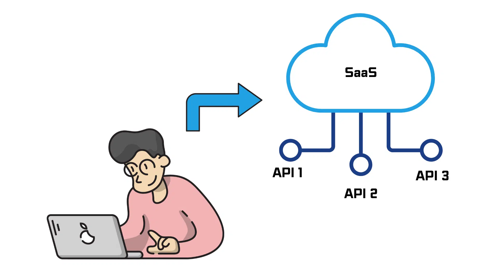

## (1) SaaS와 API의 기본 개념

> 1-1. SaaS (Software as a Service)

- **정의:** 소프트웨어를 사용자가 직접 설치하지 않고, 인터넷을 통해 서비스 형태로 제공받는 방식.
- **특징:**

  - 구독 기반(월간, 연간)
  - 클라우드 서버에서 호스팅
  - 자동 업데이트 및 유지보수 제공
- **예시:** Google Workspace, Salesforce, Zoom, Slack

> 1-2. API (Application Programming Interface)

- **정의:** 서로 다른 소프트웨어 시스템이 서로 소통할 수 있게 해주는 **인터페이스**.
- **특징:**

  - 정해진 규칙(HTTP, JSON, XML 등)을 통해 데이터 요청과 응답
  - 직접 UI를 거치지 않고, 프로그램끼리 자동으로 데이터 교환 가능

## (2) SaaS API란

- **정의:** SaaS 서비스에서 외부 시스템이나 개발자가 서비스를 확장하거나 통합할 수 있도록 제공하는 API
- **주요 목적:**

  1. **데이터 접근**: SaaS 내부 데이터를 외부 시스템에서 읽거나 쓸 수 있음
  2. **자동화**: 반복 작업을 API 호출로 자동화 가능
  3. **통합**: 다른 SaaS 서비스 또는 내부 시스템과 연동 가능

> 예시

- Salesforce API → 고객 데이터 CRUD(생성, 조회, 수정, 삭제) 가능
- Slack API → 메시지 전송, 채널 관리, 봇 개발 가능
- Stripe API → 결제, 구독 관리, 송장 생성 가능

## (3) SaaS API의 구성 요소

| `구성 요소` | `설명` |
| :---: | :---: |
| **Endpoint** | API 요청을 보낼 URL. 예: `https://api.slack.com/v1/messages` |
| **Method** | 요청 종류. 일반적으로 REST API 기준: GET, POST, PUT, DELETE |
| **Request Header** | 인증 정보(토큰, API Key)와 요청 형식(Content-Type) 포함 |
| **Request Body** | 전송할 데이터(JSON, XML 등) |
| **Response** | API 호출 후 반환되는 데이터, 상태 코드(200, 400, 401 등) 포함 |

## (4) SaaS API의 유형

1. **REST API**

   - HTTP 기반, JSON 형식 데이터 사용
   - 가장 흔하게 사용됨
   - 예: `GET /users`, `POST /invoices`

2. **GraphQL API**

   - 클라이언트가 필요한 데이터만 요청
   - 복잡한 데이터 관계 처리에 유리

3. **Webhook (Callback)**

   - SaaS에서 이벤트가 발생할 때 외부 시스템에 실시간으로 알림
   - 예: 결제 완료 시 웹훅으로 주문 상태 업데이트

4. **SDK/API Library**

   - 특정 언어용 라이브러리 제공, API 호출을 더 쉽게 해줌
   - 예: Python용 Stripe SDK

## (5) SaaS API 사용 사례

1. **CRM 자동화**

   - Salesforce API로 신규 리드가 등록되면 자동 이메일 발송
2. **결제 처리**

   - Stripe API를 통해 구독 결제 및 환불 자동 처리
3. **협업 툴 연동**

   - Slack API와 Google Calendar 연동 → 이벤트 알림 자동 전송
4. **데이터 분석**

   - SaaS 데이터를 API로 추출 → BI 도구에 자동 입력

## (6) SaaS API 활용 시 주의점

- **인증/보안**: API Key, OAuth 토큰 사용, HTTPS 필수
- **Rate Limit**: 일정 시간 내 호출 제한 존재
- **데이터 구조 변화**: SaaS 업데이트 시 Response 구조 변경 가능
- **에러 처리**: 실패 응답(400, 401, 500 등)에 대한 적절한 처리 필요
