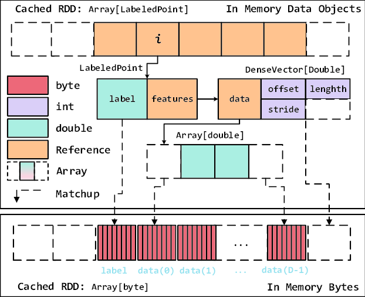

## (1) Apache Spark란

- 대규모 데이터를 `메모리 기반(In-Memory)` 으로 빠르게 처리
- 분산 환경(여러 서버)을 한 컴퓨터처럼 사용
- 배치 처리 + 스트리밍 처리 + 머신러닝 + SQL + 그래프 처리 지원
- 초창기 Hadoop MapReduce의 단점을 보완하며 등장


## (2) 구성 요소

- Spark는 여러 처리 엔진을 통합한 플랫폼입니다.

| `구성 요소` | `설명` |
| :---: | :---: |
| **Spark Core** | 분산 처리의 핵심. 메모리 관리 및 Job 스케줄링 |
| **Spark SQL** | SQL 기반 데이터 분석. DataFrame / Dataset 지원 |
| **Spark Streaming / Structured Streaming** | 실시간 데이터 처리 |
| **MLlib** | 머신러닝 알고리즘 라이브러리 |
| **GraphX** | 그래프 데이터 분석(예: SNS 연결 관계 분석) |


## (3) 아키텍처 & 동작 원리

- Spark 작업(Job)은 다음 구조로 실행됩니다:

1. `Driver Program`

   * 사용자 애플리케이션 실행 시작점
   * DAG(Directed Acyclic Graph) 생성 및 스케줄링
2. `Cluster Manager`

   * 리소스 관리
   * 예: Standalone / YARN / Kubernetes
3. `Executors`

   * 실제 데이터 처리 작업 수행 노드

> Driver가 명령하고 → Cluster Manager가 배분하고 → Executor가 계산

## ⚡ Spark의 가장 큰 장점: In-Memory 처리



### RDD(Resilient Distributed Dataset)

- Spark의 핵심 데이터 구조
- `메모리에 저장` → 디스크 I/O 최소화 → 빠른 속도
- 장애 복구: lineage(실행 이력) 기반 재처리 가능

## (4) Hadoop MapReduce vs Spark 성능 비교

| 항목 | `Hadoop MapReduce` | `Apache Spark` |
| :---: | :---: | :---: |
| 처리 방식 | 디스크 기반 | 메모리 기반 |
| 속도 | 느림 | `10~100배 빠름` |
| 처리 유형 | 주로 배치 | 배치+스트리밍+ML+그래프 |
| 복잡도 | 높음 | 단순한 API |

> `빅데이터 분석 + 실시간 처리`가 필요한 경우 Spark를 사용합니다.

## (5) Spark 프로그래밍 예시 (Python / PySpark)

```python
from pyspark.sql import SparkSession

spark = SparkSession.builder.appName("WordCount").getOrCreate()

data = spark.read.text("data.txt")
words = data.rdd.flatMap(lambda line: line.value.split(" "))
count = words.map(lambda w: (w, 1)).reduceByKey(lambda a, b: a+b)

count.show()
spark.stop()
```

## (6) Spark 사용 환경

| `환경` | `설명` |
| :---: | :---: |
| **On-Premise Cluster** | 실제 사내 서버 클러스터 |
| **Cloud (AWS EMR, Databricks, GCP Dataproc)** | 손쉽게 확장 & 관리 |
| **로컬 PC** | 테스트/학습용 standalone 모드 |

## (7) Spark는 이런 곳에서 많이 씁니다

- **실시간 로그 분석** (예: 웹/앱 사용 패턴 분석)
- **금융 사기 탐지**
- **머신러닝 추천 시스템**
- **IoT 센서 데이터 처리**
- **대규모 데이터 ETL 파이프라인**


> Apache Spark = **빅데이터를 빠르고(메모리 기반) 다양하게(실시간/ML/그래프) 처리하는 엔진**
