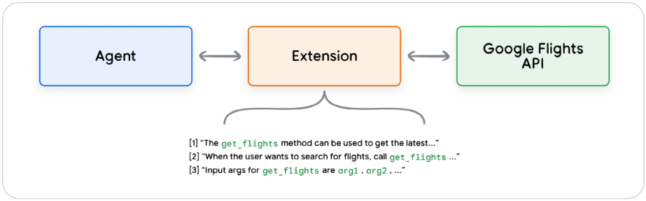
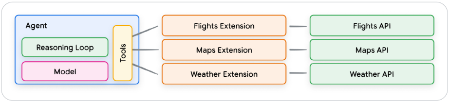
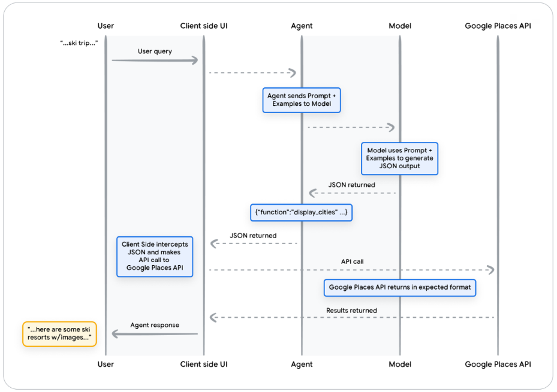

# [Agents 백서 - Google](https://www.kaggle.com/whitepaper-agents)

Authors: Julia Wiesinger, Patrick Marlow and Vladimir Vuskovic

## Agent란

GPT는 특정 텍스트 요약, 번역 등 한번의 요청에 대한 답변을 받지만, `Agent`는 사람의 간섭 없이 스스로 여러 단계들을 거치면서 생각을 하고 알맞은 결론을 결정하여 결과물을 도출하는 방식입니다.

## Agent의 전체 구조 (Orchestration, Tools, Model) 

1) 사용자가 `쿼리(Query)`를 요청합니다.
2) Agent 구조에 있는 오케스트레이션(Orchestration)이란 큰 틀에서 이미 작성을 해 높은 `프롬프트(prompt)` 또는 `인스트럭션(instruction)` 을 이용하여 생각을 하기 시작합니다.
3) 메모리(Memory) 를 이용하여 단기 기억이나 장기 기억을 사용하여 이전에 수행 했던 대화 내용들 있으면 모델(Model)에 맞게 `리즈닝(Reasoning)` 이나 `플래닝(Planning)` 을 논리를 세워서 대답하게 됩니다.
4) 만약에 `외부 결정`이 필요하면 API를 요청하여 정보를 받아 오는걸 `툴(Tools)` 에서 처리하게 됩니다.

## Agent vs Models

| Models | Agents |
| :---: | :---: |
| 지식은 학습 데이터에서 사용 가능한 것으로 제한됩니다. | 지식은 도구를 통해 외부 시스템과의 연결을 통해 확장됩니다. |
| 사용자 쿼리 기반 단일 추론/예측 모델에 명시적으로 구현되지 않는 한, 세션 기록이나 연속 컨텍스트(예: 채팅 기록)를 관리할 수 없습니다. | 관리형 세션 기록(예: 채팅 기록)을 통해 오케스트레이션 계층에서 사용자 쿼리 및 결정에 기반한 다중 턴 추론/예측이 가능합니다. 이 맥락에서 '턴'은 상호작용하는 시스템과 에이전트 간의 상호작용으로 정의됩니다. (즉, 수신 이벤트/쿼리 1건과 에이전트 응답 1건) |
| 네이티브 도구 구현이 없습니다. | 도구는 에이전트 아키텍처에 기본적으로 구현되어 있습니다. |
| 네이티브 로직 계층이 구현되지 않았습니다. 사용자는 간단한 질문으로 프롬프트를 구성하거나  추론 프레임워크(CoT, ReAct 등)를 사용하여 복잡한 프롬프트를 구성하여 모델의 예측을 안내할 수 있습니다. | CoT, ReAct와 같은 추론 프레임워크 또는 LangChain과 같은 사전 구축된 에이전트 프레임워크를 사용하는 네이티브 인지 아키텍처입니다. |

## ReAct, Chain of Thought, Tree of Thought 설명

| **모델** | **설명** | **주요 특징** | **사용 예시** |
| :---: | :---: | :---: | :---: |
| **ReAct** | `ReAct`는 추론 과정에서 **행동(Action)**과 **반응(Response)**을 번갈아 가며 생성하는 방법론입니다. 이를 통해 **동적**이고 **상황에 맞는** 반응을 끌어낼 수 있습니다. | - 행동과 반응을 번갈아가며 생성 - 복잡한 작업에서 빠른 의사결정을 가능하게 함 - 환경에 따라 행동을 조정 | 예시: 게임 플레이, 문제 해결에서의 실시간 반응 |
| **Chain-of-Thought** | `Chain-of-Thought (CoT)`는 문제 해결을 위해 **단계별 추론**을 통해 답을 구하는 접근법입니다. 생각의 흐름을 명확히 나열하여 문제를 해결하는 과정이 중요합니다. | - 단계적 추론 - 복잡한 문제를 해결하는 데 유용 - 사고 과정을 명확히 제시 | 예시: 수학 문제 풀기, 논리적 추론을 요구하는 작업 |
| **Tree-of-Thoughts** | `Tree-of-Thoughts (ToT)`는 **분기**된 사고 구조를 사용하여 다양한 가능한 경로를 탐색하며 해결책을 찾는 방법입니다. 여러 경로를 동시에 고려합니다. | - 분기된 사고 구조 - 다양한 가능성을 탐색 - 여러 후보를 동시에 고려하여 최적의 답을 찾음 | 예시: 복잡한 의사결정, 다단계 문제 해결 |

## Tools (Extension, Function, Data Stores)

### Extension

- Agent가 호출 하는 도구 입니다.

- Agent가 구글 항공편 예약 요청 시 필요한 정보를 제시 하지 않으면 오류가 발생 합니다.

- 오류 해결을 위하여 API 요청 전 `Extension` 를 만들어서 필요한 정보를 전달 할 수 있도록 데이터를 정리해서 API 요청 하도록 합니다.

- 여러 가지 `Extension` 를 준비해서 `Tools`에서 사용 할 수 있도록 해줍니다.

### Function (Use cases) 

- `Function`는 API를 직접 요청 하지 않습니다.
- `클라이언트 사이드(client-side)` 에서 호출이 됩니다.
- 데이터를 개발자가 관리를 하고 싶거나 정리해야 할때 자유도를 주기 위해서 사용합니다.

- 그림과 같이 Agent가 Function 을 사용했을 경우 API 요청은 어디서 발생 하느냐?

- Agent가 실행되는 구조 밖에서 호출하고자 할때 사용 할 수 있습니다.
- Agent가 API를 직접 호출 할 수 없는 경우에 사용 할 수 있습니다. (로그인 또는 인증이 필요한 경우)
- API 요청 후 대기가 필요한 경우에 사용 할 수 있습니다. (응답이 오래 걸리는 경우)
- API 응답을 받은 후 데이터 제어가 필요한 경우에 사용 할 수 있습니다.

- 그림과 같이 `Use cases` 흐름도를 알 수 있습니다.

### Data Store (RAG 구조) 

- Agent가 DataStore를 통해서 저장 되어 있는 데이터를 가져와 사용 할 수 있습니다.

- Tools에서 해당 Store를 요청 할 수 있도록 사용 합니다.

1. 사용자 쿼리(Query)는 임베딩(Embeddings)을 생성하기 위해 임베딩 모델로 전송됩니다.
2. 그런 다음 쿼리 임베딩은 SCaNN과 같은 매칭 알고리즘을 사용하여 벡터 데이터베이스(Vector Database)의 내용과 매칭됩니다.
3. 매칭된 콘텐츠는 벡터 데이터베이스에서 텍스트(Retrieved Content) 형식으로 검색되어 Agent에게 다시 전송됩니다.
4. Agent는 사용자 쿼리와 검색된 콘텐츠를 모두 수신한 후 응답 또는 작업을 공식화합니다.
5. 최종 응답(Response)이 사용자에게 전송됩니다.

### Tools 다시 개념 정리 

| | Extensions | Function Calling | Data Stores | 
| :---: |:---: | :----: | :---: |
| **Execution** | `Agent-Side Execution` | `Client-Side Execution` | `Agent-Side Execution` |
| **Use Case** | - 개발자는 에이전트가 API 엔드포인트와의 상호작용을 제어하기를 원합니다. - 네이티브 사전 빌드 확장 프로그램(예: Vertex Search, Code Interpreter 등)을 활용할 때 유용합니다. - 멀티홉 계획 및 API 호출 (즉, 다음 에이전트 작업은 이전 작업/API 호출의 출력에 따라 달라짐) | - 보안 또는 인증 제한으로 인해 에이전트가 API를 직접 호출할 수 없습니다. - 에이전트가 실시간으로 API 호출을 수행하지 못하게 하는 시간 제약 또는 작업 순서 제약(예: 일괄 작업, 사람이 참여하는 검토 등) - 인터넷에 노출되지 않거나 Google 시스템에서 액세스할 수 없는 API | - 사전 색인된 도메인 및 URL의 웹사이트 콘텐츠 - PDF, Word 문서, CSV, 스프레드시트 등의 형식으로 된 구조화된 데이터 - 관계형/비관계형 데이터베이스 - HTML, PDF, TXT 등의 형식에 따른 비정형 데이터 |

## Production applications with Vertex AI agents

